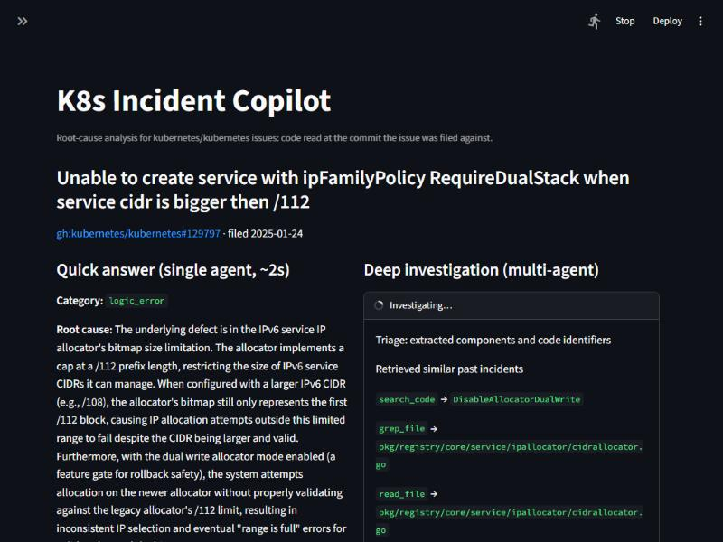
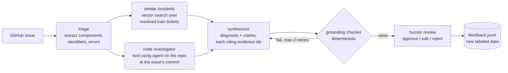
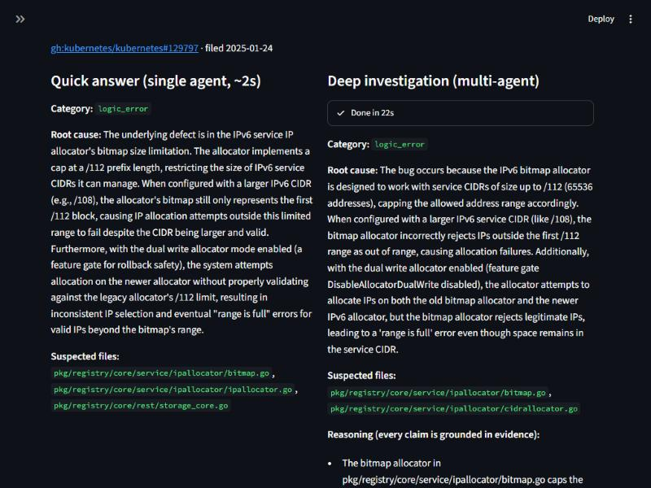
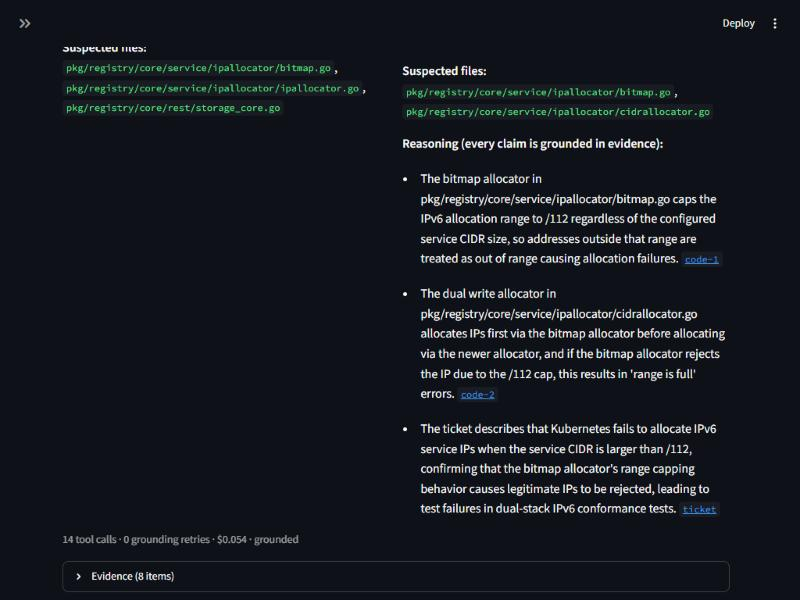

# K8s Incident Copilot

A multi-agent root-cause analysis (RCA) system for real Kubernetes bug reports. Given a GitHub issue, it reads the Kubernetes source **as it was when the issue was filed**, retrieves similar past incidents, and writes a root-cause diagnosis in which every claim cites its evidence. An engineer then approves, edits or rejects the diagnosis in a Streamlit UI.

It is evaluated on 162 real, resolved `kubernetes/kubernetes` bugs, using the merged fixing PR as ground truth, with leakage controls, paired significance tests and an explicit list of limitations.

Runs locally: Python + OpenAI API + a local clone of the Kubernetes repo.



---

## Headline results

| | Single-agent RAG baseline | Multi-agent graph (v3) | Paired test |
|---|---|---|---|
| **Finds the defective code** (dir hit, all 162) | 67% | **79%** | **+12 pts, p < 0.001** |
| **Finds the defective code** (hard slice, 68) | 56% | **74%** | **+18 pts, p = 0.002** (13 wins / 1 loss) |
| **Names the correct root cause** (RCA exact, all) | 80% | 81% | +1 pt, not significant |
| **Names the correct root cause** (hard slice) | 63% | 65% | +2 pts, not significant |
| Citations that point at real evidence | 96% | **100%** | |
| Cost / latency per ticket (p50) | $0.002 / 1.5 s | $0.042 / 56 s | |

**In short:** giving the agent commit-pinned access to the code significantly improves *where* it locates a bug, but not *why* it says the bug happens. When the investigator does reach the file the real fix changed, the diagnosis is correct 73% of the time, versus 42% when it doesn't. The remaining errors are mostly reasoning errors made by a mini model that had the right code in front of it.

*Hard slice* = tickets whose text does not already state the cause (68 of 162). *RCA exact* = a strict LLM judge scores the diagnosis as naming the same component **and** mechanism as the actual fix. *Dir hit* = a suspected path falls in a directory the fix changed.

---

## How it works



Built with **LangGraph**: a typed state, parallel branches joined at the synthesizer, a conditional retry loop, and `interrupt()` for human-in-the-loop. LLM calls use the OpenAI SDK with Pydantic structured outputs.

| Node | What it does |
|---|---|
| **triage** | Extracts components, code identifiers and error messages. The ticket itself becomes citable evidence (`ticket`). |
| **similar_incidents** | Retrieves the top-5 past incidents (`kb-*`), **only those resolved before the issue was filed**. |
| **code_investigator** | An agent with up to 14 tool calls over the repository **pinned to the last `master` commit before the issue was filed**. Tools: `search_code` (repo-wide `git grep`), `find_files`, `grep_file`, `read_file` (150-line windows to bound context). It reports findings as `code-*` evidence, with GitHub permalinks to the exact lines. |
| **synthesizer** | Writes the root cause, category, suspected files and a chain of claims, where every claim cites evidence ids. |
| **grounding_checker** | A deterministic check: every cited id must exist, every claim must cite something, and every suspected file must appear in the evidence. Failures go back to the synthesizer with feedback. |
| **human_review** | Pauses the graph (`interrupt()`). The UI resumes it with the reviewer's verdict, which is appended to `data/feedback.jsonl`. |

### The UI (`streamlit run app.py`)
- A **quick answer** from the single-agent baseline in about 2 seconds, so you're never staring at a spinner.
- The **deep investigation streams live** next to it: every tool call (`search_code → "range is full"`, …) as it happens.
- The final diagnosis has **clickable citations**: code permalinks at the pinned commit, past incidents and the ticket.
- A **review form** (approve / edit root cause or category / reject) that resumes the paused graph.

| Quick answer vs deep investigation | Every claim cites its evidence |
|---|---|
|  |  |

*Issue [#129797](https://github.com/kubernetes/kubernetes/issues/129797): the deep investigation points at `cidrallocator.go`, the file the actual fix changed, which the single-agent answer missed.*

---

## Data

| Stage | Count |
|---|---|
| Closed `kind/bug` issues, `reason:completed`, closed 2023–2025 (GitHub GraphQL) | 1,995 |
| With a merged fixing PR, after cleaning | 715 |
| Split by close date (2025-01-01) | 497 train / 218 test |
| Knowledge base (train, product code, real bugs) | 432 |
| Gold eval set (test, reviewed) | **162** of 191 candidates |

- **Ground truth comes from the fix.** `gpt-4.1-mini` read each issue together with its merged PR and wrote the root cause and category.
- **LLM review.** A second, stronger LLM then reviewed all 191 gold candidates against the fixing PR. It dropped 29 (26 feature requests or design changes, 2 with an unclear cause, 1 where the input already stated the fix). In the 162 kept, it changed the category on 20% and the root-cause text on 2%.
- **Human spot-check.** I then reviewed a random sample of 30 candidates (25 kept, 5 dropped; fixed seed) **blind** to the LLM review's verdict, using `human_spotcheck.py`:

  | Human agrees with the LLM review | |
  |---|---|
  | Root cause correct (tickets both kept) | **25 / 25** |
  | Category matches | **24 / 25** |
  | Keep vs drop decision | **25 / 30** |

  All 5 keep/drop disagreements were tickets the LLM review **dropped** that I would have kept: feature-gate validation work, a design-intent warning, test infrastructure. So the gold *labels* are reliable, and the gold *filter* is stricter than a human reviewer. It excludes some borderline tickets but doesn't admit bad ones. Raw answers: `data/clean/human_spotcheck.jsonl`; summary: `results/human_spotcheck.json`.
- **Hard vs easy.** Each gold ticket is also tagged by whether its own text already states the cause. 94 are "easy", and the 68 that don't are the **hard slice**.

### Leakage controls (each one is covered by `test_pipeline.py`)
- **Fix references are redacted.** Any reference to the fixing PR, or to any PR/issue created after the report, is removed from the input.
- **Comments stop at the fix.** Only comments posted before the fixing PR was opened are kept, and bot comments are dropped.
- **Code is read from before the fix.** The repository is read at a commit dated **before** the issue, so the fix is never in the code the agent sees. This is verified for all 162 gold tickets.
- **Retrieval is time-bounded.** It never returns an incident resolved after the issue was filed.
- **The knowledge base excludes the eval set.** It contains train tickets only and shares nothing with the gold set.

---

## Full results

95% bootstrap confidence intervals (10k resamples). Generated by `python stats.py` into [`results/RESULTS.md`](results/RESULTS.md).

| Run | RCA exact (all) | RCA exact (hard) | Dir hit (all) | Dir hit (hard) | Category | Cite ok | $/ticket | p50 |
|---|---|---|---|---|---|---|---|---|
| Baseline, no RAG | 81% [75, 88] | 65% [53, 75] | 62% [55, 70] | 53% [41, 65] | 72% | 74% | $0.0009 | 1.4 s |
| Baseline, RAG k=5 | 80% [73, 86] | 63% [51, 75] | 67% [59, 73] | 56% [44, 68] | 71% | 96% | $0.0019 | 1.5 s |
| Graph v1 | 78% [72, 84] | 63% [51, 75] | 70% [63, 77] | 63% [51, 75] | 71% | 84% | $0.013 | 15 s |
| Graph v2 | 81% [75, 87] | 65% [53, 76] | 75% [68, 81] | 65% [53, 76] | 73% | 100% | $0.031 | 35 s |
| **Graph v3** | **81% [75, 87]** | **65% [53, 75]** | **79% [72, 85]** | **74% [63, 84]** | 72% | **100%** | $0.042 | 56 s |

What changed between versions, and what each change did:

| Version | Change | Effect |
|---|---|---|
| v1 | Parallel retrieval + code investigator (8 steps, path search only) + grounding checker | Dir hit up, but 17% of answers failed grounding because the model cited the ticket, which had no evidence id |
| v2 | The ticket becomes citable evidence; 14 investigator steps; start from file paths the ticket mentions | Grounding 83% → **100%** |
| v3 | `search_code`: repo-wide content search (`git grep` at the pinned commit) | Investigator reaches the fix file on 49/68 hard tickets, up from 42; hard dir hit 65% → **74%** |

### What the experiments show
1. **Retrieval alone doesn't help diagnosis.** RAG vs no RAG shows no significant difference on any metric. Similar past incidents are rarely the same bug.
2. **Code access improves localization significantly.** Graph v3 vs the RAG baseline: +12 points dir hit (25 wins / 5 losses, p < 0.001).
3. **Diagnosis is limited by reasoning, not evidence.** On the hard slice, 13 of the 24 failures had the actual fix file in their evidence and still named the wrong mechanism. The next lever is a stronger synthesizer model, not more retrieval.
4. **Without retrieval, the model invents citations.** The no-RAG baseline cites incident ids it was never given in 26% of answers. The deterministic grounding checker takes this to 0%.

---

## Evaluation method and its limits

- **Judge.** `gpt-4.1` with a strict rubric: 2 means same component **and** mechanism, 1 means right component but a vague or different mechanism, 0 means wrong. It's a different and stronger model than the agent (`gpt-4.1-mini`). The judge was calibrated against an independent LLM review of 20 of its verdicts: a first, lenient rubric agreed on only 14/20, all of them over-scored; the strict rubric agrees on **16/20**, with disagreements in both directions. The judge itself has not been validated by a human.
- **Run-to-run noise.** On tickets whose input was identical across two runs, about 9% of verdicts flipped. Differences under about 5 points shouldn't be read as real; use the confidence intervals and paired tests above.
- **Inputs include pre-fix discussion, not just triage time.** The input is the issue plus comments posted before the fixing PR was opened (the fix itself redacted), not a strict 24-hour triage window. A sensitivity run (`sensitivity_24h.py`) that restricts the baseline to the first 24 hours of comments lowers RCA exact from **80% to 73%** (hard slice: 63% to 53%; p = 0.03 on all tickets). Absolute scores are therefore somewhat optimistic for true triage-time use. **System comparisons are unaffected**, since every run saw identical inputs.
- **Gold labels are LLM-written and LLM-reviewed, with a human spot-check.** The 162 gold labels were extracted by one LLM and reviewed by a second; a blind human spot-check of 30 found every sampled root cause correct (25/25) and the category matching on 24/25 (see [Data](#data)). The other 132 gold labels have not been checked by a human, and knowledge-base labels are LLM-extracted and unreviewed.
- **Scope.** One repository (Kubernetes), Go code, bugs fixed by a single linked PR. Most of the test issues (126 of 162) were filed in 2025, which reduces, but doesn't rule out, the chance that the models memorized them.

---

## Run it locally

**Requirements:** Python 3.13, git, about 2 GB of disk, an OpenAI API key and a GitHub token (read-only, public repos).

```powershell
pip install -r requirements.txt
git clone --bare https://github.com/kubernetes/kubernetes.git data/k8s.git     # ~1.4 GB, one time
```

`.env` in the project root:
```
OPENAI_API_KEY=sk-...
GITHUB_TOKEN=github_pat_...
```
Optional overrides: `MODEL` (default `gpt-4.1-mini`), `JUDGE_MODEL` (`gpt-4.1`), `EMBED_MODEL` (`text-embedding-3-small`).

**Launch the UI:**
```powershell
streamlit run app.py
```
Enter any `kubernetes/kubernetes` issue number, or pick one from the eval set. For issues newer than your clone, the app fetches `master` automatically before investigating.

**Run the tests** (no API cost):
```powershell
python test_pipeline.py
```

### Reproduce the pipeline
| Step | Command | Approx. cost |
|---|---|---|
| Fetch issues + linked PRs | `python fetch_issues.py` | free (GitHub API) |
| Clean, redact, split | `python build_dataset.py` | free |
| Extract root-cause labels | `python extract_rca.py` then `python merge_rca.py` | ~$1–2 |
| Gold set | `python select_gold.py`, review (`streamlit run review_app.py`), `python finalize_gold.py` | free |
| Human spot-check | `streamlit run human_spotcheck.py` (30 tickets, blind) | free |
| Knowledge base | `python build_kb.py` | < $0.01 |
| Baselines | `python baseline.py 0`, `python baseline.py 5` | ~$0.50 |
| Multi-agent graph | `python graph.py` | ~$7 |
| Judge + metrics | `python eval_baseline.py 5`, `python eval_baseline.py graph` | ~$0.40 per run |
| Statistics | `python stats.py` | free |
| 24h sensitivity check | `python sensitivity_24h.py` | ~$0.70 |

All batch scripts are resumable (they skip tickets already in the output file). `graph.py` runs 2 tickets in parallel to stay under a 200k tokens-per-minute OpenAI limit.

---

## Project layout

```
app.py               Streamlit UI: quick answer, live investigation, human review
graph.py             LangGraph multi-agent graph + commit-pinned git code tools + batch eval runner
baseline.py          Single-agent RAG baseline (also the UI's quick answer)
rca_shared.py        Shared: OpenAI client, categories, retrieval, metrics
eval_baseline.py     LLM-as-judge (strict rubric, cached) + metrics table
stats.py             Bootstrap CIs + paired McNemar tests -> results/RESULTS.md
sensitivity_24h.py   Triage-time (24h comments) sensitivity check
test_pipeline.py     Correctness + leakage tests
human_spotcheck.py   Blind human spot-check of the LLM-reviewed gold set
fetch_issues.py, build_dataset.py, extract_rca.py, merge_rca.py,
select_gold.py, review_app.py, finalize_gold.py, build_kb.py     Data pipeline
data/clean/          tickets, ground truth, gold reviews
data/kb/             knowledge base + embeddings
results/             predictions, judge verdicts, graph traces, RESULTS.md
```

## Possible next steps
- **A stronger synthesizer model,** replayed on the saved evidence in `results/graph_traces.jsonl`. This targets the 13 hard failures where the right code was already found.
- **Lower latency.** Parallel tool calls, stopping early once a confident finding exists, and using the quick answer as the default with the deep run on demand.
- **A durable checkpointer** (SQLite or Postgres) so that a review in progress survives an app restart. The current `InMemorySaver` doesn't.
- **A strict 24-hour triage-window dataset** for true triage-time numbers.
